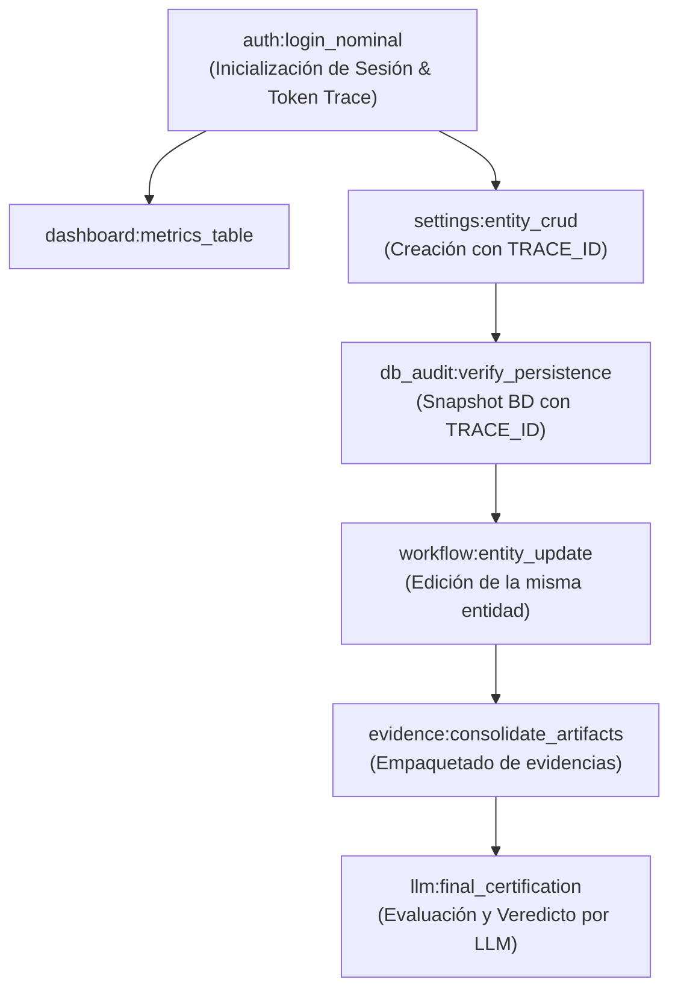

# QDD Composable Human QA & Usability Graph Engine 🎭🐹📁🗄️📱♿

El skill **`qdd-human-certifier`** permite certificar de forma autónoma y con rigor industrial los flujos de usuario de una aplicación web, simulando interacción humana real en múltiples dispositivos, auditando la persistencia en base de datos y garantizando la trazabilidad de extremo a extremo.

---

## 🏛️ PRINCIPIOS Y CONOCIMIENTO BASE POR DEFECTO

### 1. 🐹 Stack Predeterminado: Playwright con Golang (`playwright-go`)
- **Estándar por Defecto:** Todo script, módulo o scaffold de prueba de interacción humana se implementa prioritariamente en **Go (Golang)** utilizando `github.com/playwright-community/playwright-go`.
- **Estructura Estricta QDD:**
  - **Cero sentencias `else`:** Todo control de flujo se realiza mediante *guard clauses* y retornos tempranos (`return`).
  - **Salida más rápida primero:** Manejo inmediato de errores (`if err != nil { return ... }`).
  - **Limpieza garantizada:** Uso de `defer` para cerrar páginas, contextos de navegador, transacciones de BD y liberar recursos.

### 2. 📁 Carpeta de Evidencia Aislada por Ejecución (1 Run = 1 Carpeta)
- Cada ejecución genera automáticamente un directorio único e inmutable:
  ```text
  .qdd/evidence/run_YYYYMMDD_HHMMSS_<RUN_UUID>/
  ├── manifest.json            # Metadatos del run, token de trazabilidad, timings, estado
  ├── screenshots/             # Capturas por paso en doble viewport (Desktop y Mobile)
  │   ├── step_01_desktop.png
  │   ├── step_01_mobile.png
  │   └── ...
  ├── traces/                  # Archivos .zip de Playwright Trace para depuración
  ├── db_snapshots/            # Volcados JSON del estado relevante de la Base de Datos
  │   ├── 00_pre_state.json    # Estado antes de ejecutar la acción
  │   ├── 01_step_created.json # Estado tras la creación
  │   └── 99_post_state.json   # Estado final consolidado
  ├── network_logs/            # Logs de peticiones HTTP/WS, payloads enviados y recibidos
  └── backend_logs/            # Logs de aplicación (confirmación de cero errores 5xx/warnings)
  ```

### 3. 🧠 El LLM es el Juez y Certificador Final (LLM-as-a-Judge)
- **Regla Suprema:** Los scripts mecánicos y aserciones automatizadas son únicamente **recolectores de evidencia**. **SIEMPRE es el LLM que invoca la habilidad quien decide si la prueba PASÓ o FALLÓ.**
- **Protocolo de Decisión del LLM:**
  1. **Inspección Visual:** Analizar las capturas en `screenshots/` para detectar desalineaciones, textos truncados, solapamientos (*clipping*), *layout shifts* o fallas de contraste en desktop y mobile.
  2. **Auditoría de Base de Datos:** Comparar los snapshots en `db_snapshots/` para confirmar que los datos se persistieron exactamente como debían, con integridad referencial y sin registros huérfanos.
  3. **Inspección de Red y Logs:** Validar en `network_logs/` y `backend_logs/` que no existan excepciones no controladas o errores silenciosos (HTTP 500, warnings de DB, etc.).
  4. **Emisión de Certificado:** El LLM genera el veredicto fundado (`PASS` / `FAIL`) y redacta el reporte `QDD_PR_CERTIFICATE.md`.

### 4. 🗄️ Inspección y Verificación Profunda en Base de Datos
- Las pruebas de UI nunca deben darse por aprobadas únicamente por lo que muestra la interfaz o por respuestas optimistas en el frontend.
- **Acciones Obligatorias:**
  - **Pre-check:** Consultar la BD antes de la acción para asegurar el estado inicial limpio.
  - **In-flight check:** Verificar que cada mutación en la UI impacte la tabla correspondiente en la BD.
  - **Post-check:** Validar que los campos, llaves foráneas, marcas de tiempo y estados finales sean correctos.
  - **Detección de Errores Silenciosos:** Consultar tablas de logs (`error_logs`, `audit_logs`, `jobs_failed`) para asegurar que el backend no haya arrojado excepciones inadvertidas.

### 5. 🔗 Trazabilidad Continua de Datos (Single-Entity Lineage)
- Al certificar un flujo completo (ej. Registro -> Creación -> Edición -> Consulta -> Eliminación):
  - **Generación de Token Único:** Se genera una entidad trazable única para el run (ej. `TRACE_ID = "QDD_TEST_20260831_A9F2"`).
  - **Inyección y Seguimiento Ininterrumpido:** La entidad creada (ej. usuario `qa_QDD_TEST_20260831_A9F2@app.test` o producto `SKU_QDD_TEST_20260831_A9F2`) debe ser seguida **paso a paso**.
  - **Validación en Cada Instante:** En cada pantalla y consulta a BD, el test debe verificar explícitamente que está interactuando con **exactamente ese mismo dato**, previniendo falsos positivos por registros genéricos o datos precargados.

---

## 🧩 ARQUITECTURA DE GRAFO DE PRUEBAS (DAG)

Cada flujo se modela como un nodo modular con dependencias explícitas en un Grafo Acíclico Dirigido:



---

## 🚀 MODOS DE EJECUCIÓN

1. **Ejecución vía QDD CLI (Golang):**
   ```bash
   qdd certify human [target]
   ```
2. **Ejecución Directa de Runner Go:**
   ```bash
   go test -v ./qa/human -run TestHumanCertificationDAG
   ```
3. **Ejecución Modular por Categoría:**
   ```bash
   qdd certify human auth
   qdd certify human usability
   qdd certify human accessibility
   qdd certify human e2e_flow
   ```

---

## 📱 VIEWPORTS Y ERGONOMÍA OBLIGATORIA
- **Desktop:** `1440x900`, `devicePixelRatio: 1`, simulación de hover y scroll natural.
- **Mobile:** `390x844` (iPhone viewport), `hasTouch: true`, `isMobile: true`, gestos táctiles.
- **Fricción Cognitiva (TTA):** Registro del tiempo requerido por acción (objetivo: < 3.0s login, < 5.0s formularios complejos).
- **Protección contra Rage Clicks:** Validación de debounce y estados `disabled`/`loading` ante clics rápidos repetitivos.

---

## 🛡️ REGLAS DE CODIFICACIÓN INQUEBRANTABLES
1. **NUNCA USAR `else` ni `else if`** en ningún script o módulo. Utilizar siempre cláusulas de guarda y retornos tempranos.
2. **Salida más rápida primero:** Colocar validaciones de error y casos límite al inicio de cada función.
3. **Documentación de Bugs y Tests Unitarios:** Todo defecto descubierto durante la certificación debe registrarse como `Finding` y acompañarse de un test unitario reproducible.

---

## 📚 GUÍAS DE REFERENCIA DETALLADAS
- **[Guía Playwright con Golang](file:///home/dpailahueque/Documents/proyectos/qdd/.qdd/core/plugins/qdd-human-certifier/skills/qdd-human-certifier/references/PLAYWRIGHT_GOLANG_GUIDE.md)**: Patrones de diseño en Go, inicialización, interceptores y aserciones zero-else.
- **[Ciclo de Vida de Evidencias](file:///home/dpailahueque/Documents/proyectos/qdd/.qdd/core/plugins/qdd-human-certifier/skills/qdd-human-certifier/references/EVIDENCE_LIFECYCLE.md)**: Estructura de carpetas por ejecución, manifiestos JSON y capturas.
- **[Verificación en BD y Trazabilidad](file:///home/dpailahueque/Documents/proyectos/qdd/.qdd/core/plugins/qdd-human-certifier/skills/qdd-human-certifier/references/DB_VERIFICATION_ENTITY_TRACKING.md)**: Consultas SQL, validación de persistencia y seguimiento de tokens únicos.
- **[Arquitectura de Grafo DAG](file:///home/dpailahueque/Documents/proyectos/qdd/.qdd/core/plugins/qdd-human-certifier/skills/qdd-human-certifier/references/DAG_ARCHITECTURE.md)**: Topología de pruebas, resolución de dependencias y ejecución ordenada.
- **[Simulación de Comportamiento Humano](file:///home/dpailahueque/Documents/proyectos/qdd/.qdd/core/plugins/qdd-human-certifier/skills/qdd-human-certifier/references/HUMAN_SIMULATION.md)**: Cadencia, micro-delays, viewports y WCAG 2.2.
