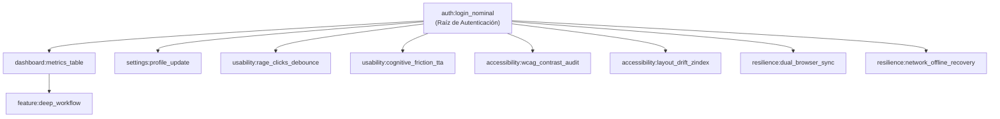

# QDD Composable Human QA & Usability Graph Engine 🎭🧩📱♿

Este skill permite a los agentes de IA ejecutar de forma autónoma y modular pruebas de comportamiento humano sobre cualquier aplicación web, resolviendo automáticamente las **dependencias de flujo en un Grafo Acíclico Dirigido (DAG)**.

---

## 🧩 ARQUITECTURA DE GRAFO DE PRUEBAS (DAG)

Cada flujo se encapsula en una unidad modular e independiente dentro de `scripts/human_qa/units/` (o la ruta configurada en `.qdd/human_qa.config.json`):



---

## 🚀 MODOS DE EJECUCIÓN

1. **Flujo Específico (con resolución automática de dependencias)**:
   ```bash
   node scripts/human_qa/index.mjs auth:login_nominal
   ```
2. **Categoría Completa**:
   ```bash
   node scripts/human_qa/index.mjs usability
   node scripts/human_qa/index.mjs accessibility
   node scripts/human_qa/index.mjs resilience
   ```
3. **Grafo Completo del Sistema**:
   ```bash
   node scripts/human_qa/index.mjs all
   ```

---

## ⚡ SERVIDOR LOCAL NATIVO ZERO-LATENCY

El motor incluye un servidor HTTP nativo puro (`local_frontend_server.mjs`) que:
- Inicia en menos de **10ms**.
- Sirve los bundles de producción compilados (`dist/`, `build/`, `.next/`, etc.) sin latencia externa.
- Maneja fallback SPA para rutas profundas.

---

## 🛡️ CRITERIOS DE CERTIFICACIÓN OBLIGATORIOS
- **100% PASS** en todas las unidades seleccionadas.
- **Doble Viewport**: Desktop (1440x900) y Mobile (390x844).
- **Cero sentencia `else`** en el código de prueba.
