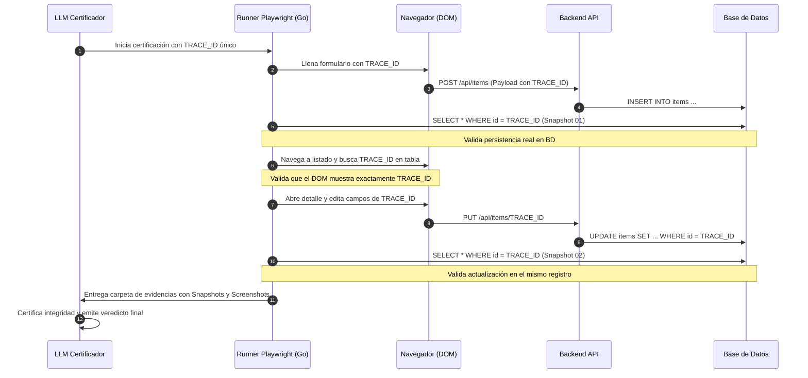

# Inspección en Base de Datos y Trazabilidad Continua de Datos 🗄️🔗

En el marco de gobernanza QDD, **una prueba de interfaz humana NO se considera válida sin una verificación directa del estado de la Base de Datos y un seguimiento ininterrumpido de la misma entidad de datos**.

---

## 1. 🗄️ PRINCIPIOS DE VERIFICACIÓN EN BASE DE DATOS

### ¿Por qué la verificación de UI sola es insuficiente?
- **Actualizaciones optimistas:** El frontend puede mostrar un registro creado con éxito aunque la petición HTTP haya fallado o la transacción en BD haya hecho *rollback*.
- **Cachés locales (IndexedDB / State):** Los datos pueden vivir en memoria del navegador sin haberse persistido en el servidor.
- **Excepciones silenciosas en backend:** Un servicio puede responder `HTTP 200 OK` con un payload de advertencia mientras registra errores en tablas de auditoría.

### Fases Obligatorias de Inspección en BD:
1. **Pre-Check:** Verificar que la base de datos se encuentra en un estado conocido y limpio antes de iniciar la interacción.
2. **In-Flight Snapshot:** Capturar el estado de la BD inmediatamente después de cada mutación crítica en la UI.
3. **Post-Check:** Confirmar que todos los campos modificados, relaciones foráneas y marcas de tiempo (`updated_at`, `created_at`) coincidan con lo esperado.
4. **Auditoría de Tablas de Error:** Consultar tablas del sistema (ej. `error_logs`, `audit_trail`, `failed_jobs`) para asegurar que no se generaron excepciones durante el flujo.

---

## 2. 🔗 TRAZABILIDAD CONTINUA DE LA MISMA ENTIDAD (Single-Entity Lineage)

Cuando se certifica un flujo completo de usuario (ej. Crear -> Listar -> Modificar -> Eliminar), **se debe rastrear y validar a cada instante que se está interactuando con exactamente el mismo dato**.



---

## 3. 🛠️ IMPLEMENTACIÓN EN GOLANG (Zero-Else & Early Return)

### Generación de Token de Trazabilidad Único
```go
package humanqa

import (
    "crypto/rand"
    "encoding/hex"
    "fmt"
    "time"
)

func GenerateTraceToken() (string, error) {
    bytes := make([]byte, 4)
    if _, err := rand.Read(bytes); err != nil {
        return "", fmt.Errorf("error generando entropía para trace token: %w", err)
    }
    return fmt.Sprintf("QDD_TR_%s_%s", time.Now().Format("20060102"), hex.EncodeToString(bytes)), nil
}
```

### Snapshot de Base de Datos y Validación de Persistencia
```go
package humanqa

import (
    "database/sql"
    "encoding/json"
    "fmt"
    "os"
    "path/filepath"
)

type EntityRecord struct {
    ID        string `json:"id"`
    Title     string `json:"title"`
    Status    string `json:"status"`
    UpdatedAt string `json:"updated_at"`
}

func CaptureDBSnapshot(db *sql.DB, traceToken, evidenceDir, snapshotName string) (*EntityRecord, error) {
    if db == nil {
        return nil, fmt.Errorf("conexión de base de datos es nula")
    }

    query := "SELECT id, title, status, updated_at FROM items WHERE title LIKE ? LIMIT 1"
    row := db.QueryRow(query, "%"+traceToken+"%")

    var rec EntityRecord
    if err := row.Scan(&rec.ID, &rec.Title, &rec.Status, &rec.UpdatedAt); err != nil {
        return nil, fmt.Errorf("no se encontró registro con traceToken %s en BD: %w", traceToken, err)
    }

    // Guardar snapshot en carpeta de evidencia del run
    data, err := json.MarshalIndent(rec, "", "  ")
    if err != nil {
        return nil, fmt.Errorf("error serializando snapshot: %w", err)
    }

    outPath := filepath.Join(evidenceDir, "db_snapshots", snapshotName+".json")
    if err := os.WriteFile(outPath, data, 0644); err != nil {
        return nil, fmt.Errorf("error escribiendo snapshot a disco: %w", err)
    }

    return &rec, nil
}
```

### Verificación de Ausencia de Errores en BD
```go
func VerifyZeroBackendErrors(db *sql.DB, startTime time.Time) error {
    if db == nil {
        return fmt.Errorf("conexión a base de datos nula")
    }

    var count int
    query := "SELECT COUNT(*) FROM error_logs WHERE created_at >= ?"
    if err := db.QueryRow(query, startTime).Scan(&count); err != nil {
        // Si no existe la tabla error_logs, retornamos nil (skip)
        return nil
    }

    if count > 0 {
        return fmt.Errorf("se detectaron %d errores en error_logs del backend durante la ejecución", count)
    }

    return nil
}
```

---

## 4. 🧠 EVALUACIÓN DEL LLM

El LLM que ejecuta la certificación debe:
1. Comprobar que el `TRACE_ID` generado al inicio coincide exactamente con el valor capturado en los formularios de la UI.
2. Confirmar mediante `db_snapshots/` que el ID y los valores en la base de datos corresponden al mismo registro a lo largo de todo el ciclo de vida.
3. Constatar que ninguna consulta a base de datos retornó registros nulos, datos de otros usuarios o estados incoherentes.
