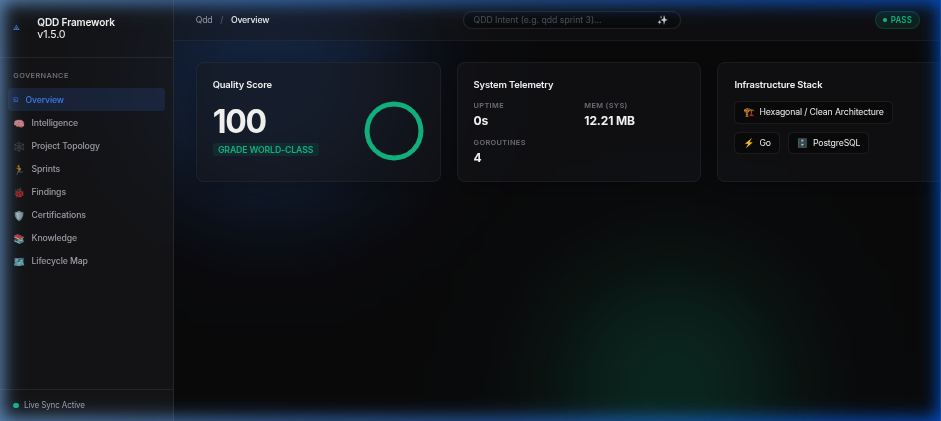
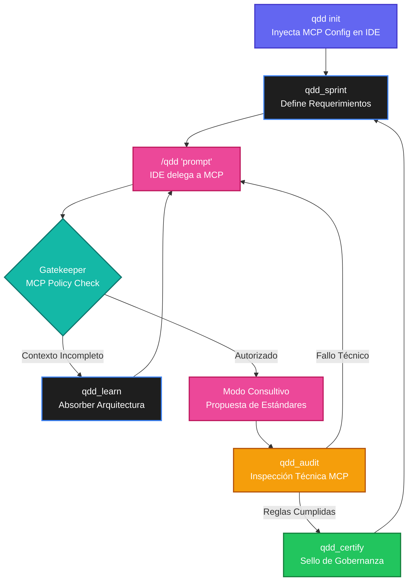

# QDD Framework — Quality-Driven Development

[](https://goreportcard.com/report/github.com/trdago/qdd-framework)
[](https://opensource.org/licenses/MIT)
[](https://github.com/trdago/qdd-framework/releases)
[](https://github.com/trdago/qdd-framework/actions)
[](#)

<p align="center">
  
</p>

> QDD no es un generador de código.  
> QDD no es un asistente de programación.  
> QDD no es un agente conversacional.  

**QDD es una Plataforma de Ingeniería de Software basada en Mejora Continua**, cuyo propósito es ayudar a construir y evolucionar productos de software preparados para producción siguiendo estándares de clase mundial.

La Inteligencia Artificial es solamente uno de sus motores. El verdadero propósito de QDD es preservar, incrementar y gobernar el conocimiento del proyecto durante todo su ciclo de vida.

---

## 🎯 Problema que buscamos resolver

Actualmente las herramientas de IA generan código, sin embargo:
- No preservan el conocimiento del sistema.
- Generan prototipos y maquetas desechables sin estándares de producción.
- No convierten los bugs en conocimiento permanente.
- No mantienen una certificación viva del software.
- Sacrifican la calidad y mantenibilidad a largo plazo por velocidad inmediata.

QDD resuelve este problema operando bajo el **Manifiesto QDD** y el principio fundamental de **Production-First Engineering**.

---

## 🧠 Filosofía y Principios Fundamentales

- **Production-First:** QDD no genera ejemplos desechables. Toda solución se diseña pensando en su operación a largo plazo y debe poder desplegarse en producción con calidad profesional.
- **El conocimiento es el activo principal:** El código no es la fuente de verdad, la fuente de verdad es el conocimiento acumulado (Certificaciones, ADRs, Findings).
- **Modo Consultivo y Certificación:** QDD actúa como un Arquitecto Principal. Nunca escribirá código deficiente ciegamente. Si detecta la oportunidad de implementar un estándar (ej. OpenAPI, OWASP, Clean Architecture), detendrá la ejecución, entrará en Modo Consultivo, explicará los beneficios y pedirá autorización.
- **Findings Become Knowledge:** Cada bug descubierto se transforma automáticamente en conocimiento permanente, generando nuevas pruebas, certificaciones y evidencias.
- **Backward Compatibility First:** Nunca se rompen contratos automáticamente. Si hay que modificar APIs o contratos públicos, el framework solicita autorización explícita.

---

## 🚀 Getting Started: Ciclo Completo de Desarrollo Gobernado

El siguiente ejemplo demuestra cómo se utiliza QDD para desarrollar de forma iterativa y segura.

### 1. Inicialización e Inyección de MCP
Prepara el entorno y haz que tu IDE (Cursor, Claude Code, Antigravity) absorba el contexto arquitectónico de tu proyecto automáticamente vía MCP:
```bash
qdd init
```

### 2. Identificación de Brechas (Auditoría Segura)
Visualiza tu deuda técnica y calidad en el panel de control interactivo.
```bash
qdd dashboard   # Visualiza el Centro de Comando (ver captura de arriba)
```

### 3. Aplicación de Soluciones (Cognitive Path)
Delega la solución de problemas desde tu IDE. Las herramientas MCP de QDD (`qdd_audit`, `qdd_learn`, `qdd_certify`) gobernarán a tu IA para que aplique estándares de producción.
```bash
/qdd "resuelve los bugs críticos identificados en el validador"
```

### 4. Certificación y Entrega Automática
Tu asistente verificará que el nuevo código cumpla las reglas usando las herramientas MCP antes de sugerir el despliegue.

---

## 🔄 Ciclo de Vida (Arquitectura MCP)



---

## Instalación

### Opción 1: NPM (Recomendado para Web Devs)
```bash
npm install -g qdd-framework
```

### Opción 2: Compilación Manual (Go)
```bash
go install github.com/trdago/qdd-framework/cli@latest
```

---

## 🏗️ Arquitectura General

QDD está compuesto por:
- **Wisdom Registry:** La mente y constitución del proyecto (`.qdd/core/wisdom/`).
- **Specification:** Definiciones independientes del modelo de IA.
- **Runtime MCP (Model Context Protocol):** El motor principal que expone las herramientas a tu IDE (`qdd_audit`, `qdd_certify`, etc.).
- **Dashboard:** Centro de Comando Web que despliega el *Intelligence Report*.
- **AI Adapters:** Integraciones Zero-Config para Cursor, Claude Code y Antigravity.

---

## 🌟 Capacidades Avanzadas

El framework soporta y obliga comportamientos avanzados tanto para humanos como para la IA:

1. **Intelligent Certification Tags:** Los certificados (`CERT-*.yaml`) ahora declaran `tags`. QDD asocia certificados automáticamente según los tags inferidos del código (ej. `.vue` hereda certificados con tags de `frontend`).
2. **Layered Certifications (Certificaciones Anidadas):** El motor exige que toda funcionalidad pase un nivel mínimo global (`core`) **Y** obligatoriamente al menos un certificado de negocio del proyecto (`isCore: false`). Si no existen certificados de negocio, la funcionalidad falla con la alerta `MISSING-PROJECT-CERT`.
3. **Zero-Else Enforcement Nativo:** El framework predica con el ejemplo; no utiliza la cláusula `else` ni `v-else` internamente, apoyándose 100% en *Guard Clauses* y retornos tempranos para bajar la complejidad cognitiva.
4. **Command Pipelining (`qdd run`):** QDD soporta encadenamiento secuencial nativo de comandos. Puedes ejecutar múltiples fases interdependientes como una tubería, aislando estado:
   ```bash
   qdd run validate certify dashboard
   ```

---

## 🤝 Contribuyendo y RFCs

QDD es un estándar abierto enfocado en gobernar el desarrollo de software seguro y auditable. Lee `CONTRIBUTING.md` para más información.
