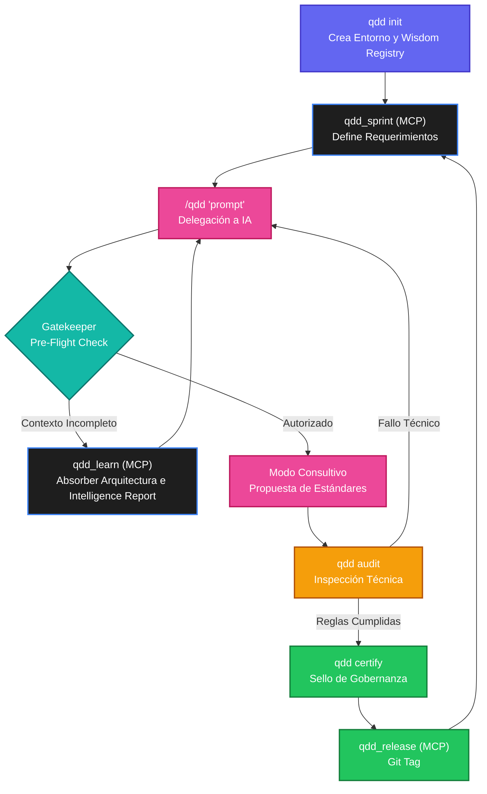

# Command Reference

La interfaz de línea de comandos de QDD (QDD CLI) se divide en dos rutas:
1. **Fast Path**: Comandos deterministas que se ejecutan localmente sin IA.
2. **Cognitive Path (QCL)**: El motor inteligente y consultivo para certificar, auditar o arreglar código.

## Mapa del Ciclo de Mejora Continua (Lifecycle)

Este diagrama representa el flujo de trabajo orquestado para mantener la base de código segura, auditable y moderna en un ciclo infinito de integración continua.



## The Safe Boundary: Análisis vs Mutación

En QDD existe una línea estricta que separa **leer/auditar** de **modificar el código**. Los comandos de auditoría están diseñados para ser 100% seguros (Read-Only) y jamás alterarán tu código fuente.

> ⚠️ **Solo los comandos de esta página que NO llevan la etiqueta "(MCP)" existen como subcomandos reales de la CLI** (probá `qdd <comando> --help`). Los que sí la llevan solo existen como *tools* MCP: no funcionan tipeados directo en la terminal — hay que pedirle a un IDE con IA conectado por MCP (Claude Code, Cursor, Antigravity) que las invoque. Ver FND-019.

### 🛡️ Comandos Seguros (Read-Only / Auditoría) — CLI real
Estos comandos puedes ejecutarlos sin miedo directo en la terminal. Su único trabajo es leer tu repositorio y reportar su estado:

| Comando | Descripción |
|---------|-------------|
| `qdd audit` | Ejecuta un Linter estático asegurando las reglas del framework (ej. Cero uso de `else`). **Seguro.** |
| `qdd certify` | Revisa la carpeta `.qdd/core/certification/` y emite un veredicto de calidad del proyecto. **Seguro.** |
| `qdd doctor` | Verifica que el entorno QDD esté completamente funcional (checklist determinista). **Seguro.** |
| `qdd dashboard` | Inicia el Centro de Comando Web. Despliega el Intelligence Report, métricas, Sprints y Certificaciones. **Seguro.** |
| `qdd evolution` | Estudia findings abiertos, certificaciones pendientes, violaciones de auditoría e historial de score para recomendar la única siguiente mejora accionable. No crea ni certifica nada por sí solo (Modo Consultivo). **Seguro.** |
| `qdd benchmark` | Evalúa la calidad de respuesta (Cognitive Quality) del framework. **Seguro.** |

### ⚡ Comandos de Mutación (Estructurales) — CLI real
Estos comandos modifican el repositorio agregando carpetas o archivos de gobernanza:

| Comando | Descripción |
|---------|-------------|
| `qdd init` | Inicializa el entorno creando el directorio `.qdd/`, `config.yaml`, y lo más importante, el **Wisdom Registry** (`manifesto.md`). |
| `qdd run <cmd1> <cmd2>...` | Ejecuta subcomandos de QDD en secuencia como una tubería (ej. `qdd run audit certify`), abortando si alguno falla. |
| `qdd run --keep-alive <cmd>` | Supervisa un proceso externo (un binario, un servicio) manteniéndolo siempre vivo: lo reinicia en cada salida limpia. Ante un error real, registra un Finding + evidencia y luego invoca a un agente de IA local (Claude, Antigravity o Cursor — el primero disponible) para diagnosticar y aplicar el fix real de forma desatendida (`--dangerously-skip-permissions`), reintentando hasta 3 veces antes de detenerse para revisión humana. Ver ADR-004 (supersede ADR-003). |
| `qdd bug` | Registra manualmente un error como Finding permanente con evidencia asociada (mismo mecanismo que usa `qdd run --keep-alive` internamente). |

### 🤖 Solo vía MCP — pedile a tu IDE con IA que las invoque
Estas *tools* existen y funcionan, pero únicamente a través del servidor MCP — tipear `qdd learn` (por ejemplo) en una terminal no hace nada útil:

| Tool MCP | Descripción |
|---------|-------------|
| `qdd_learn` | Explora el código base para asimilar arquitecturas e invoca a la IA para redactar/refinar el **Intelligence Report** (`.qdd/understanding.json`) — incremental desde FND-020. |
| `qdd_status` | Panel de control. Escanea el repositorio para mostrar certificaciones activas y *Findings* (bugs) abiertos. |
| `qdd_score` | Calcula tu calificación de calidad matemática (Ej: 100/100 World-Class). |
| `qdd_sprint <n>` | Crea la plantilla de trabajo para una nueva iteración en `.qdd/project/sprints/`. |
| `qdd_release <version>` | Compila, actualiza la versión en `state.json`, y crea un Git Tag **local** (no hace push ni publica). |
| `qdd_sync` | Sincroniza las reglas nativas y el Manifiesto con los adaptadores de IA (Cursor, Claude Code, Antigravity) de forma idempotente. |
| `qdd_findings` | Lista los findings del proyecto con su estado. |
| `qdd_evolution` | Misma lógica que el comando CLI `qdd evolution`, disponible también para que la IA la invoque. |
| `qdd_map` | Genera el mapa topológico de certificación del proyecto (`.qdd/project/topology.json`). |
| `qdd_query_graph` | Ejecuta SQL de solo lectura sobre el grafo de conocimiento (`.qdd/knowledge.db`). |
| `qdd_harness_generate` | Genera el system prompt combinado (Agentic Harness) para el IDE conectado. |

### 🚧 Documentados pero no implementados (roadmap, no lo intentes en la CLI ni por MCP)
Estos aparecían en versiones previas de esta misma página describiendo funcionalidad que nunca se construyó — no existen en ninguna forma hoy: `qdd validate`, `qdd review`, `qdd ui`, `qdd api`, `qdd db`, `qdd docs`, `qdd sync-ai`. Si tu caso de uso necesita alguno, es una propuesta de feature nueva, no un comando que puedas invocar ya.

## Cognitive Path (Pipeline Inteligente vía MCP)

El motor cognitivo interno del CLI ha sido deprecado. En su lugar, QDD actúa como un **Servidor MCP** que transfiere su gobernanza directamente a tu IDE (Cursor, Claude Code, Antigravity).

Para invocar a la Inteligencia Artificial bajo el amparo de QDD, utiliza los comandos integrados de tu IDE:

```bash
/qdd "agrega autenticación a la API"
/qdd "resuelve la deuda técnica en el validador"
```

### 🧠 Capacidades del Ecosistema MCP
- **Modo Consultivo (Production-First)**: El framework inyecta reglas que prohíben a la IA ser un "generador de código ciego". Si pides algo que requiera certificación (ej. Autenticación), la IA te propondrá un estándar (ej. OWASP ASVS) y solicitará tu aprobación antes de implementar, gracias a las políticas del MCP.
- **Guardián (Gatekeeper)**: Las herramientas de MCP (`qdd_audit`, `qdd_certify`) abortarán la misión si el código generado por la IA no cumple los estándares estrictos (ej. uso de `else`).
- **Detección de Intención y Riesgo**: A través de las *tools* expuestas, la IA evalúa si tu petición romperá la retrocompatibilidad antes de programar.
