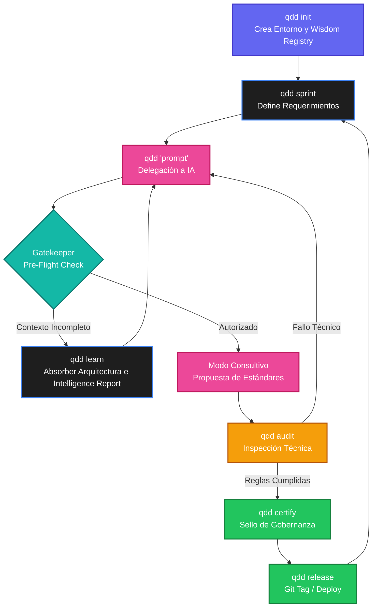

# Command Reference

La interfaz de línea de comandos de QDD (QDD CLI) se divide en dos rutas:
1. **Fast Path**: Comandos deterministas que se ejecutan localmente sin IA.
2. **Cognitive Path (QCL)**: El motor inteligente y consultivo para certificar, auditar o arreglar código.

## Mapa del Ciclo de Mejora Continua (Lifecycle)

Este diagrama representa el flujo de trabajo orquestado para mantener la base de código segura, auditable y moderna en un ciclo infinito de integración continua.



## The Safe Boundary: Análisis vs Mutación

En QDD existe una línea estricta que separa **leer/auditar** de **modificar el código**. Los comandos de auditoría están diseñados para ser 100% seguros (Read-Only) y jamás alterarán tu código fuente.

### 🛡️ Comandos Seguros (Read-Only / Auditoría)
Estos comandos puedes ejecutarlos sin miedo. Su único trabajo es leer tu repositorio y reportar su estado:

| Comando | Descripción |
|---------|-------------|
| `qdd learn` | Explora el código base para asimilar arquitecturas e invoca al Motor Cognitivo para redactar el **Intelligence Report**. **Seguro.** |
| `qdd status` | Panel de control. Escanea el repositorio para mostrar certificaciones activas y *Findings* (bugs) abiertos. **Seguro.** |
| `qdd score` | Calcula tu calificación de calidad matemática (Ej: 100/100 World-Class). **Seguro.** |
| `qdd audit` | Ejecuta un Linter estático asegurando las reglas del framework (ej. Cero uso de `else`). **Seguro.** |
| `qdd certify` | Revisa la carpeta `.qdd/certification/` y emite un veredicto de calidad del proyecto. **Seguro.** |
| `qdd dashboard` | Inicia el Centro de Comando Web. Despliega el Intelligence Report, métricas, Sprints y Certificaciones. **Seguro.** |

### ⚡ Comandos de Mutación (Estructurales)
Estos comandos modifican el repositorio agregando carpetas o archivos de gobernanza:

| Comando | Descripción |
|---------|-------------|
| `qdd init` | Inicializa el entorno creando el directorio `.qdd/`, `config.yaml`, y lo más importante, el **Wisdom Registry** (`manifesto.md`). |
| `qdd sprint <n>` | Crea la plantilla de trabajo para una nueva iteración modificando `.qdd/sprints/`. |
| `qdd release <version>` | Genera un Git Tag oficial y actualiza la versión del framework en `state.json`. |
| `qdd sync` / `qdd sync-ai` | Sincroniza las reglas nativas y el Manifiesto con los asistentes de IA (Cursor, Claude Code, Antigravity) configurando los perfiles de manera idempotente. |

## Cognitive Path (Pipeline Inteligente)

Para invocar a la Inteligencia Artificial, simplemente escribe tu intención:

```bash
qdd "agrega autenticación a la API"
qdd "resuelve la deuda técnica en el validador"
```

### 🧠 Capacidades del QCL (QDD Cognitive Layer)
- **Modo Consultivo (Production-First)**: El motor no es un "generador de código ciego". Si pides algo que requiera certificación (ej. Autenticación), pausará la ejecución, te propondrá un estándar (ej. OWASP ASVS) y solicitará tu aprobación antes de implementar.
- **Guardián (Gatekeeper)**: El CLI abortará la misión si falta conocimiento esencial en `config.yaml` hasta que ejecutes `qdd learn`.
- **Detección de Intención**: Diferencia si quieres hacer un *Feature*, un *Fix*, o un *Ask*.
- **Resolución de Ambigüedades**: Si tu orden es muy vaga, pausará el flujo y te mostrará opciones interactivas en tu consola.
- **Análisis de Riesgo**: Antes de programar, evaluará si tu petición romperá la retrocompatibilidad.
- **Estrategia (Strategy Planner)**: Diseñará qué artefactos crear antes de tocar el código (ej. Findings, ADRs).
