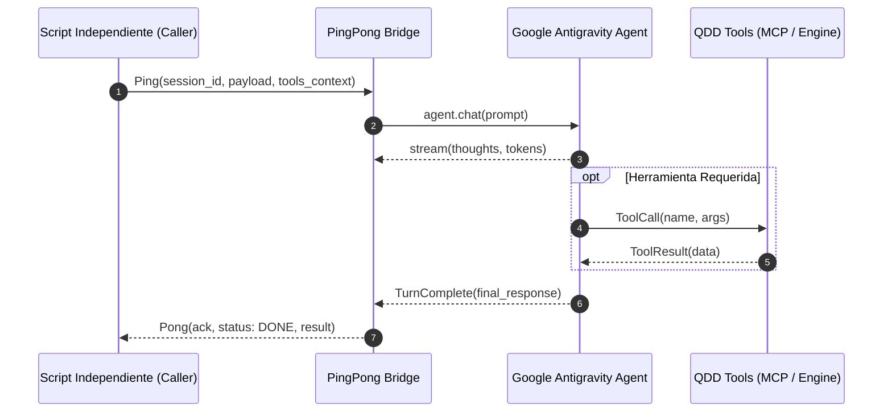

# QDD Antigravity Tools & Autonomous Ping-Pong Bridge ⚡📡🤖

Este skill proporciona la arquitectura completa para conectar cualquier script independiente (Python, Node.js, Go) con el ecosistema de agentes **Google Antigravity**, utilizando su SDK oficial (`google.antigravity`), integración MCP y el protocolo reactivo **Ping-Pong**.

---

## 🎯 CAPACIDADES PRINCIPALES

1. **Conexión Programática Directa**:
   - Conexión vía Python SDK (`Agent`, `LocalAgentConfig`, `CapabilitiesConfig`).
   - Conexión vía MCP JSON-RPC Server & Client (Node.js/TypeScript/Go).
2. **Protocolo Ping-Pong (Zero-Polling Handshake)**:
   - Elimina los `while True: sleep()` mediante el modelo de eventos reactivos (`Reactive Wakeup`).
   - Sincronización determinista de turnos entre procesos externos y el agente.
3. **Streaming de Pensamientos y Herramientas**:
   - Monitoreo en vivo de `response.thoughts`, `response.tool_calls` y tokens de salida.
4. **Prompt Maestro Paso a Paso**:
   - Sistema de prompts pre-entrenado y optimizado para guiar a Antigravity en tareas complejas con retroalimentación continua.

---

## 🔄 CICLO DE VIDA PING-PONG



---

## 📁 GUÍAS Y REFERENCIAS TÉCNICAS

- 📡 **Protocolo Ping-Pong Detallado:** [`references/PING_PONG_PROTOCOL.md`](references/PING_PONG_PROTOCOL.md)
- 📜 **Prompt Maestro Paso a Paso:** [`references/PROMPT_STEP_BY_STEP.md`](references/PROMPT_STEP_BY_STEP.md)

---

## 🚀 EJEMPLO RÁPIDO DE USO (PYTHON)

```python
import asyncio
from runtime.python.ping_pong_client import AntigravityPingPongClient

async def main():
    client = AntigravityPingPongClient(
        system_instructions="Eres un agente de ingeniería gobernado por QDD."
    )
    
    # Ping: Envía mensaje y recibe streaming reactivo sin polling
    async with client.session() as session:
        pong = await session.ping(
            prompt="Audita la arquitectura del proyecto y genera el informe.",
            on_token=lambda t: print(t, end="", flush=True)
        )
        print(f"\n[PONG RECIBIDO] Status: {pong.status} | Duración: {pong.duration_ms}ms")

if __name__ == "__main__":
    asyncio.run(main())
```
